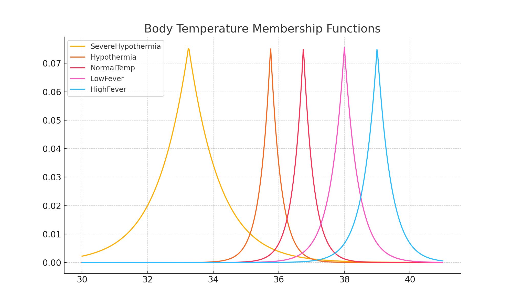
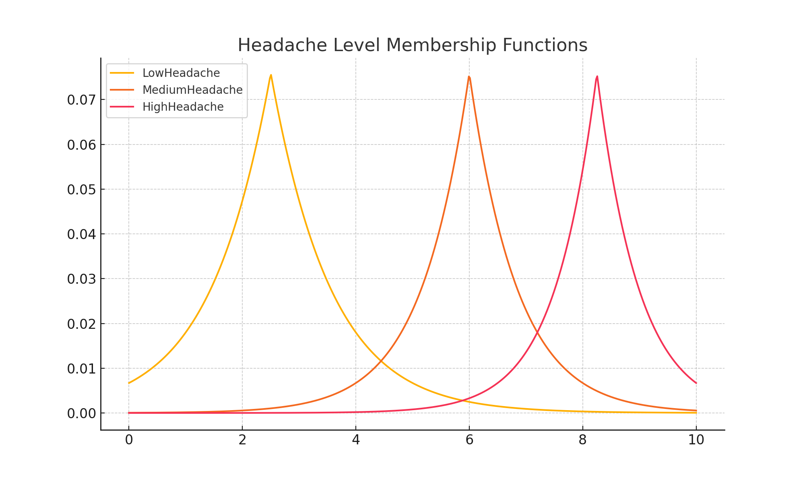
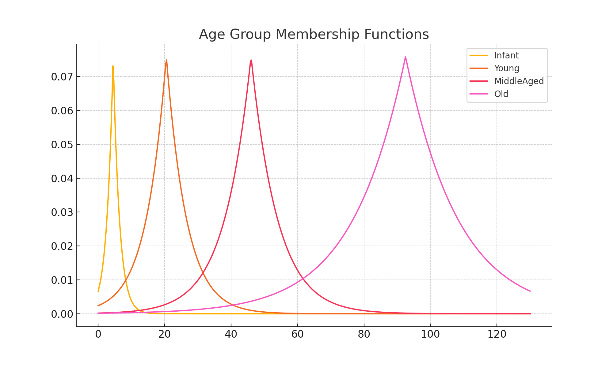

# Fuzzy Urgency Inference System

This repository provides a modular, production-ready fuzzy logic system to assess medical urgency based on patient inputs: body temperature, age, and headache severity.

## Features
- Case 1: Crisp input fuzzy system
- Case 2: Interval-based fuzzy logic using NSFLS
- Custom "Stupa" membership function
- Modular utilities for fuzzification, inference, defuzzification
- CLI usage with `main.py`

## Installation
```bash
pip install -r requirements.txt
```

## Usage
```bash
python main.py --case 1 --temperature 37.5 --headache 8.5 --age 6
python main.py --case 2 --temperature_range 36 39 --headache_range 7 10 --age_range 3 9
```

## Project Structure
- `models/`: Contains logic for crisp and interval-based fuzzy systems
- `utils/`: Core functions for membership, inference, etc.
- `tests/`: Validation scripts
- `data/`: Sample inputs
- `configs/`: Configurations

## 📊 Visual Plots of Membership Functions

### Body Temperature Terms


### Headache Severity Terms


### Age Group Terms


## Example Output

Case 1 (Crisp):
```
Urgency Score: 88.76
```

Case 2 (Interval):
```
Urgency Score: 66.49
```
